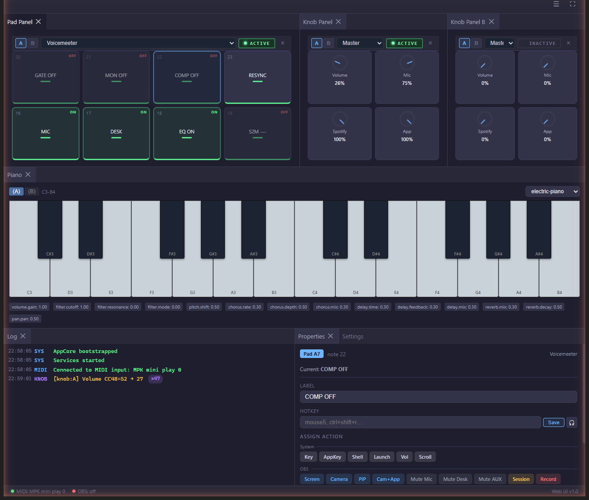
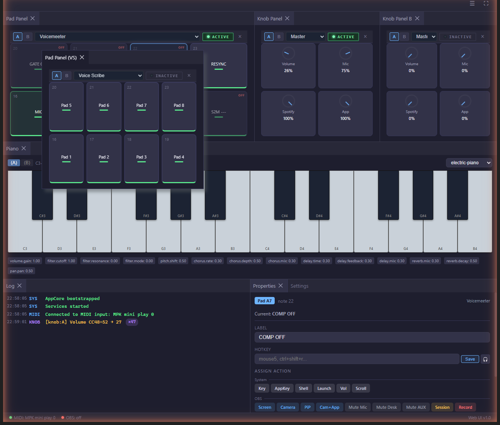
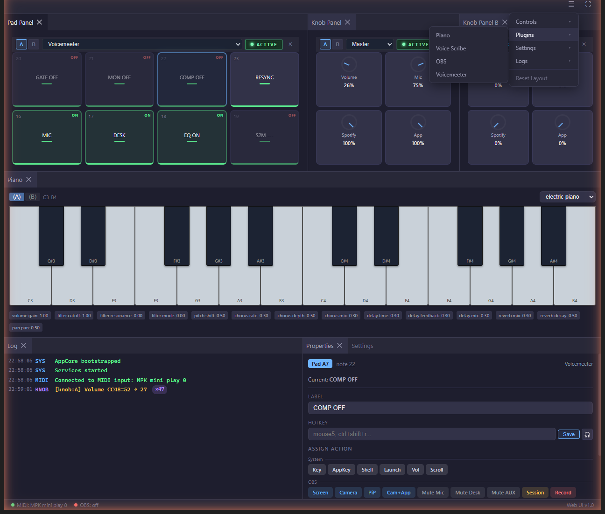

# MIDI Macropad

Turn an **Akai MPK Mini Play** or any MIDI controller into a tactile Windows control surface for shortcuts, app-aware modes, audio control, and AI-assisted writing.

Python backend (FastAPI + mido) with a modern **React + dockview Web UI** that runs in your browser or a desktop launcher window.

<p align="center">
  
</p>

## Why I Built This

I wanted a desk tool that felt more physical than keyboard shortcuts and more personal than a generic stream deck.

The goal was simple: keep everyday actions on real pads and knobs, switch behavior automatically depending on the active app, and make one mode especially useful for modern work, **Voice Scribe**. That plugin lets me speak naturally in Russian and instantly paste polished English into Slack, email, docs, or chats without breaking focus.

## What It Does

- Turns 8 pads, 4 knobs, and the joystick into configurable actions.
- Switches between presets defined in `config.toml` (OBS, Voice Scribe, Sound Pads, Voicemeeter, OBS Session, Spotify, Piano, and more).
- Controls Windows master volume, microphone volume, and Spotify app volume.
- Talks to OBS Studio over WebSocket.
- Connects to **Spotify** over the Web API with OAuth PKCE (Client ID only—[developer.spotify.com](https://developer.spotify.com/dashboard)); now-playing, transport, and knob-mapped volume. **Spotify Premium** required.
- Plays short device-side MIDI feedback phrases on the controller for actions and voice states.
- Loads plugins from `plugins/` for custom MIDI behavior and web UI panels.
- **Web UI**: dockview-based draggable panels, freeform pad/knob panels with per-panel bank+preset, live WebSocket events, fullscreen mode, accessible from any browser on your LAN.
- **Piano plugin**: SFZ/SF2 polyphonic playback with a 7-effect stereo FX chain (volume / filter / pitch / chorus / delay / reverb / pan), lock-free producer/consumer audio engine, and WASAPI low-latency output.

## Voice Scribe

**Voice Scribe is the flagship plugin of the project.**

It is a voice-first writing workflow for bilingual work:

- Speak in Russian and paste refined English directly at the cursor.
- Use prompt-driven styles for professional replies, summaries, socials, and custom tones.
- Capture selected text as context before speaking.
- Run a multi-turn "Speak" mode that keeps conversation context.
- Hard-cancel an in-flight voice turn so stale results cannot paste into the current app.
- Edit prompts in the built-in Prompt Editor.
- Choose a microphone, test input levels, and store the API key in the UI.
- Hear dedicated MIDI cues on the device for record start/stop, session and segment boundaries, context capture, processing, done, cancel, and errors.

Pipeline: **microphone → Whisper transcription → GPT rewrite/translation → clipboard paste**

Feedback path: **shared runtime feedback service → MIDI out → controller's internal GM synth**

## Plugins

| Plugin | Summary |
|--------|---------|
| `Voice Scribe` | Voice-driven Russian-to-English writing assistant with prompt styles, context capture, chat memory, hard cancel, and MIDI feedback cues. |
| `Sample Player` | Polyphonic WAV pad sampler with pack selection, velocity response, and plugin volume control. |
| `OBS Session` | Connects to OBS, composite scene switching, segmented recording into a session folder, optional ffmpeg stitch and Whisper subtitles. |
| `Voicemeeter` | Routes pads and knobs to Voicemeeter macro / volume workflows. |
| `Spotify` | OAuth PKCE Web API control, now-playing, transport, pad and knob mappings. Requires Premium and a Client ID. |
| `Performance Template` | Optional live sketch template: pad beat toggles, key-triggered drums and guitar phrases, 9 switchable chord keys. |
| `REAPER Bridge` | Forwards Bank B MIDI to REAPER DAW. |
| `Piano` | SFZ/SF2 polyphonic synth with stereo FX chain, lock-free audio engine, knob-mapped FX parameters. |

More detail lives in [`docs/plugins.md`](docs/plugins.md).

## Quick Start

**Requirements:** Windows 10/11, Python 3.11+, Node.js 18+ (for frontend build)

```bash
git clone https://github.com/myfunc/midi-macropad.git
cd midi-macropad
python -m venv .venv
.venv\Scripts\activate
pip install -r requirements.txt
cd frontend && npm install && npm run build && cd ..
```

Launch the app:

```bash
python launcher.pyw
```

Or double-click **`MIDI Macropad Web.bat`** / the launcher GUI. The launcher manages the backend, rebuilds the frontend when source changes, shows logs, and opens the Web UI in your browser.

**URL:** `http://10.0.0.27:8741` (configurable via `HOST`/`PORT` in `web_main.py` and `launcher.pyw`).

### Dev mode (frontend hot reload)

Run backend and Vite dev server separately:

```bash
python web_main.py --dev            # backend with CORS
cd frontend && npm run dev          # Vite HMR on :5173
```

## Web UI Tour

The frontend is built around dockview — every panel is draggable, dockable, floatable, and can be opened multiple times.

### Freeform pad / knob panels

Pad and knob panels are no longer fixed slots. Open as many as you like, give each one a bank (A or B) and a preset, and toggle exclusivity through an engineering-style activate button. Only one panel can be active per `(type, bank)`; activating another auto-deactivates the previous. Inactive panels stay fully editable, they just don't receive MIDI events.

<p align="center">
  
</p>

### Submenu navigation

A single hamburger menu groups everything: **Controls** to add new pad/knob panels, **Plugins** for the plugin panels (Piano, Voice Scribe, OBS, Voicemeeter…), **Settings** and **Logs**. Submenus fly out to the left.

<p align="center">
  
</p>

## Documentation

- [`docs/web-ui.md`](docs/web-ui.md) — Web UI architecture, launcher, panels
- [`docs/overview.md`](docs/overview.md) — project overview, features, and presets
- [`docs/plugins.md`](docs/plugins.md) — plugin catalog with a deeper Voice Scribe breakdown
- [`docs/audio-cheatsheet.md`](docs/audio-cheatsheet.md) — Voicemeeter routing and audio setup
- [`docs/obs-scene-setup.md`](docs/obs-scene-setup.md) — OBS scene configuration guide

## License

[MIT](LICENSE)
