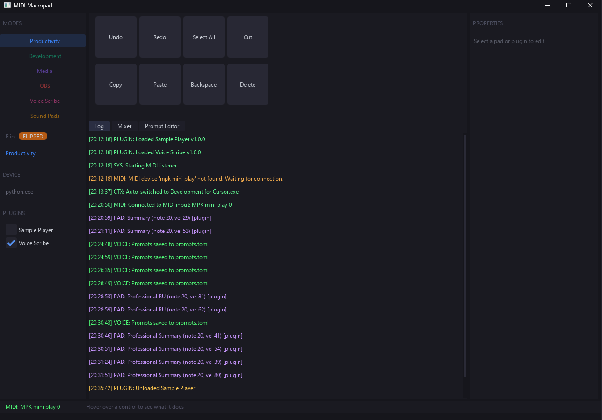

# MIDI Macropad

Turn an **Akai MPK Mini Play** or any MIDI controller into a tactile Windows control surface for shortcuts, app-aware modes, audio control, and AI-assisted writing.

Built with Python, [DearPyGui](https://github.com/hoffstadt/DearPyGui), and [mido](https://mido.readthedocs.io/).

<p align="center">
  
</p>

## Why I Built This

I wanted a desk tool that felt more physical than keyboard shortcuts and more personal than a generic stream deck.

The goal was simple: keep everyday actions on real pads and knobs, switch behavior automatically depending on the active app, and make one mode especially useful for modern work, **Voice Scribe**. That plugin lets me speak naturally in Russian and instantly paste polished English into Slack, email, docs, or chats without breaking focus.

## What It Does

- Turns 8 pads, 4 knobs, and the joystick into configurable actions.
- Switches between dedicated modes such as Productivity, Development, Media, OBS, Voice Scribe, and Sound Pads.
- Adds a Performance mode where pads toggle beat layers and the piano keys trigger drums, riffs, and switchable chord banks.
- Detects the active window and can change mode automatically.
- Controls Windows master volume and microphone volume.
- Talks to OBS Studio over WebSocket.
- Plays short device-side MIDI feedback phrases on the controller for actions and voice states.
- Loads plugins from `plugins/` for custom MIDI behavior and UI panels.

## Voice Scribe

**Voice Scribe is the flagship plugin of the project.**

It is a voice-first writing workflow for bilingual work:

- Speak in Russian and paste refined English directly at the cursor.
- Use prompt-driven styles for professional replies, summaries, socials, and custom tones.
- Capture selected text as context before speaking.
- Run a multi-turn "Speak" mode that keeps conversation context.
- Hard-cancel an in-flight voice turn so stale results cannot paste into the current app.
- Edit prompts in the built-in Prompt Editor.
- Choose a microphone, test input levels, and store the API key in the UI.
- Hear dedicated MIDI cues on the device for record start/stop, context capture, processing, done, cancel, and errors.

Pipeline: **microphone -> Whisper transcription -> GPT rewrite/translation -> clipboard paste**

Feedback path: **shared runtime feedback service -> MIDI out -> controller's internal GM synth**

## Plugins

| Plugin | Summary |
|--------|---------|
| `Voice Scribe` | Voice-driven Russian-to-English writing assistant with prompt styles, context capture, chat memory, hard cancel, and MIDI feedback cues. |
| `Sample Player` | Polyphonic WAV pad sampler with pack selection, velocity response, and plugin volume control in `Sound Pads` mode. |
| `Performance Template` | Live sketch template for MPK Mini Play: pad beat toggles, key-triggered drums and guitar phrases, plus 9 switchable chord keys. |

More detail lives in [`docs/plugins.md`](docs/plugins.md).

## Quick Start

**Requirements:** Windows 10/11, Python 3.11+

```bash
git clone https://github.com/myfunc/midi-macropad.git
cd midi-macropad
python -m venv .venv
.venv\Scripts\activate
pip install -r requirements.txt
python main.py
```

After the first setup, you can also launch it via `MIDI Macropad.bat`.

## Documentation

- [`docs/overview.md`](docs/overview.md) — short project overview, features, and modes
- [`docs/plugins.md`](docs/plugins.md) — plugin catalog with a stronger Voice Scribe breakdown
- [`researches/2026-03-19_voice-feedback-cues.md`](researches/2026-03-19_voice-feedback-cues.md) — rationale for MIDI-only feedback cues and Voice Scribe hard cancel

## License

[MIT](LICENSE)
